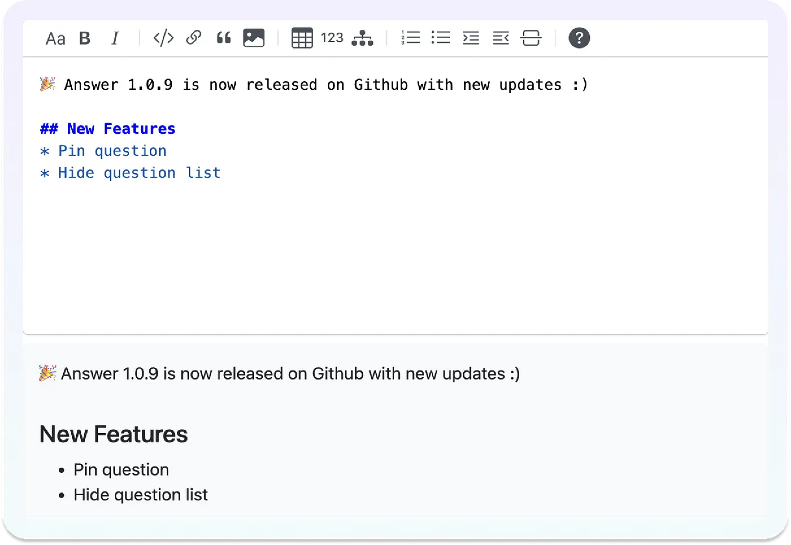
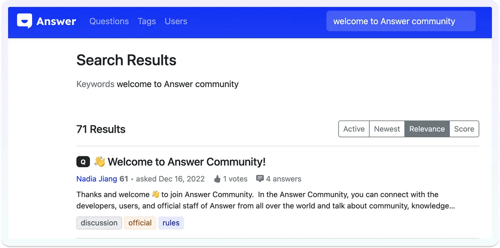

We’ve discussed knowledge retention is the challenge of today, since knowledge scatters like fragments of a grand puzzle, waiting to be discovered and connected. Besides having a knowledge sharing platform, running a knowledge base is also an effective strategy for knowledge retention, and the best part is you can build your one with Answer easily.

If you’re considering having a knowledge base, you’re in the right place. In today’s read, we’ll explain knowledge base, benefits, and a self-host knowledge base built with Answer.

## What is Knowledge Base
In a simple way: a knowledge base is an online library where you can store, organize, and retrieve information easily.

Sounds big, right? In fact, you must use one of them for sure since a knowledge base takes various forms, such as databases, wikis, documents, articles, FAQs (Frequently Asked Questions), manuals, tutorials, or any other structured or unstructured format.

## Why You Need it
We expect to retrieve the right information at the moment, and the process must be quick. That’s why we need a knowledge base that contains a wide range of information and easy-to-search, and check the benefits.

## Benefits
1. Easy Access to Information
A knowledge base provides a structured and organized system for storing information, making it easily accessible to users. It allows quick retrieval of relevant data, reducing the time and effort required to search for information.

2. Improved Productivity and Efficiency
By having a knowledge base in place, employees can find the information they require without relying on others or spending excessive time searching for it. This increases productivity and efficiency in performing tasks by empowering users to find information independently.

3. Knowledge retention and Sharing
A knowledge base serves as a repository for capturing and preserving institutional knowledge within an organization. It helps to retain critical information even when employees leave or change roles.

4. Consistency and Accuracy
With a knowledge base, organizations can ensure consistency and accuracy in the information. It minimizes errors and conflicts, allowing for standardized procedures, guidelines, and documentation, reducing the risk of errors or inconsistencies caused by outdated or conflicting information.

5. Customer Self-service and Support
Knowledge bases are commonly used in customer support to provide self-service options. By offering a comprehensive collection of FAQs, troubleshooting guides, and instructional materials, customers can find solutions to their problems without the need to contact support, reducing support costs and improving customer satisfaction.

## Build Knowledge Base with Answer
Make sure you have the right tools for hosting and managing your knowledge base. Answer is the tool you can give it a go, it’s open-source and for free. Here are some delighted features in Answer that help you to build an efficient knowledge base at ease.

1. Get Started with the Useful Docs       
We’ve prepared [Docs](https://answer.dev/docs) for you to kick-start your knowledge base smoothly, and if you need help, you can always post a question in our [Community](https://meta.answer.dev/).

2. Real-time Preview for Each Post             
Always make sure your knowledge is accurate and shinning before it goes live. In Answer, you can instantly view the layout of the post before hitting the post button.

3. Use Tags to Categorize the Content             
Add new tags to set up your knowledge management system in Answer right away, no need to add questions beforehand. Users can follow content they are interested by following tags, while admins can always edit tags description.

4. Pin a Post
Pin an important or frequently asked question for your knowledge base, so that it always stays on the top of your knowledge base.

5. Search and Find What You Need
Answer provides advanced search, including tag, author, question, etc. so that you can always access to the knowledge you require at present quickly.

## Don’t Take Our Words for Answer. Take His. 
One of our users, [David Filed](https://blog.safewebbox.com/author/david/) have built a self-hosted knowledge base with Answer. He also shared a [blog](https://blog.safewebbox.com/a-self-hosted-knowledgebase-which-feels-much-like-stackoverflow/) about why he chose Answer, and a step-by-step tutorial of installing and running Answer. 

Follow his tutorial or our [Docs](https://answer.dev/docs) to build a knowledge base of your own now, and embrace the power of knowledge base today.
