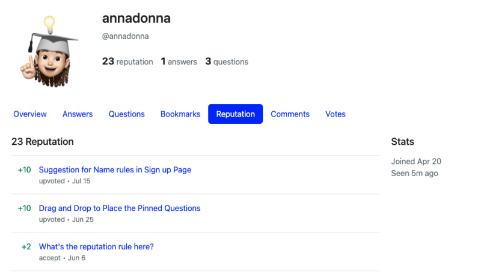
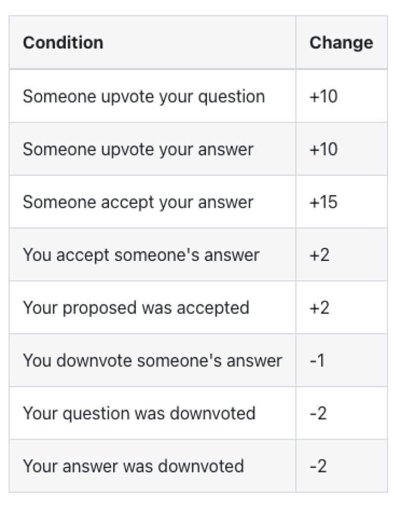
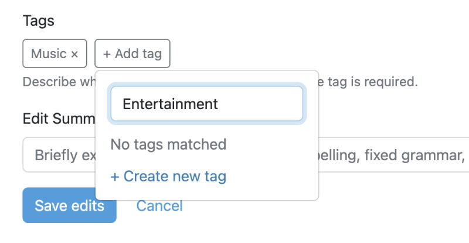
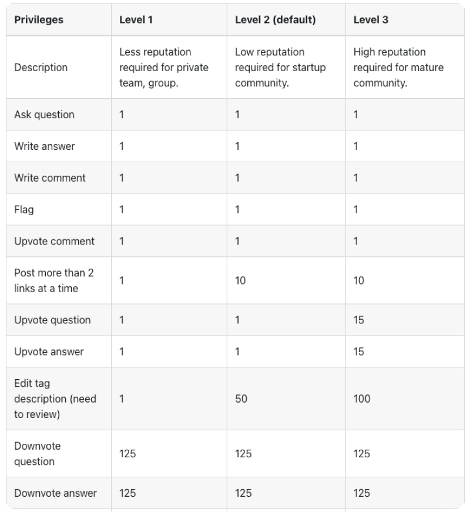

Reputation score is a reflection of a community member’s credibility. Community members establish this based on their actions and contributions. Simultaneously, a reputation system is formed to track participants' trustworthiness, credibility, and behavior.

Besides [tagging](../2023-07-11-the-what-why-using-tags-for-online-community/index.md), [reputation](https://answer.dev/docs/recipes/contents/reputation) is an important part of **content management** in Answer. Community members gain reputation scores by adhering to community guidelines and continuous contributions. Community moderators and administrators use reputation scores to determine user privileges. This helps run and maintain a healthy community environment and discourages disruptive behavior.

## Purposes of Reputation
In the mid-1900s, eBay introduced a feedback system, allowing buyers and sellers to rate each other based on transaction experience. This feedback mechanism, which influenced the reputation of users, helped build trust within the [Q&A platform](../2023-05-12-what-is-q-and-a-platform-and-how-to-use-it/index.md). 

You can still find this mechanism running in Answer — community members upvote question or answer, accept answer, etc. Find out how we implement it for different purposes for a thriving online community. 

## Ways to Implement Reputation System in Answer

### 1. Trust Building          
A positive reputation indicates credibility, reliability, and expertise. In Answer, you can always find a reputation score next to the name, providing an initial impression of the community member.

Click the name and jump to a community member’s profile page, where it includes reputation and related contributions.

### 2. Rewards and Penalties    
Answer appreciate and encourage positive contributions, such as providing helpful answers, valuable content, upvote useful answers. Meanwhile, negative actions like downvote, spamming or abusive behavior can result in reputation penalties. 

Click [here](https://answer.dev/docs/recipes/contents/reputation) for Answer's complete reputation rules that might inspire you.

### 3. Moderation and Governance
After activation in Answer, community members will gain 1 reputation score, and are allowed to participate in general activities in the community, such as asking questions, writing answers, upvote comment, etc. Reputation scores are also used by community moderators and administrators to determine user [privileges](https://answer.dev/docs/recipes/contents/permission), such as posting more than 2 links at a time, creating a new tag, etc. 

In Answer, you’ll need 125 reputation scores to downvote, while downvote someone’s answer will reduce one reputation score. This prevents malicious downvoting and boosts answers through intentional others’ answers. This helps maintain a healthy community environment and discourage disruptive behavior. 

The scale of communities is different, so is the reputation system. We’ve prepared 3 different privilege levels for teams at different scales. 

### 4. Community Engagement
The reputation system allows community members to actively engage in the community. They can share expertise, contribute to discussions, and vote for better answers, fostering a positive and collaborative environment.

## Conclusion
Reputation in an online community is a reflection of a user’s contributions, engagement, and commitment to the community. We know the reputation system is dynamic, and it’s hard to build one from the ground, that’s why we’ve already got a complete [reputation](https://answer.dev/docs/recipes/contents/reputation) and [permission](https://answer.dev/docs/recipes/contents/permission) rules for you, and it runs perfectly fine in our [official community](https://meta.answer.dev/).

By the time you [install](https://answer.dev/docs/installation) Answer successfully, the reputation system is already there. All you need to do is to choose the right reputation level for your community in the Admin page. 

By automating this reputation system, your members are encouraged to share and become a significant part of the community. [Start Answer](https://answer.dev/docs/) now and shape the growth of the community along with other like-minded community members.
