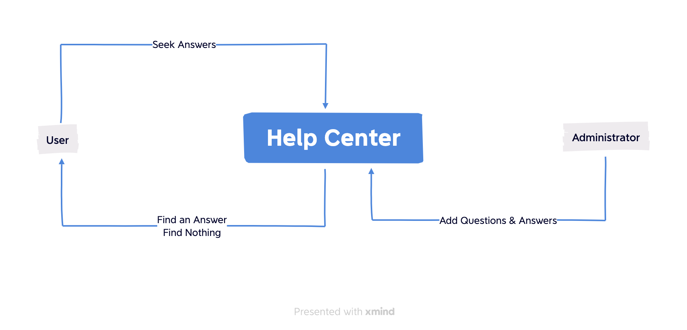
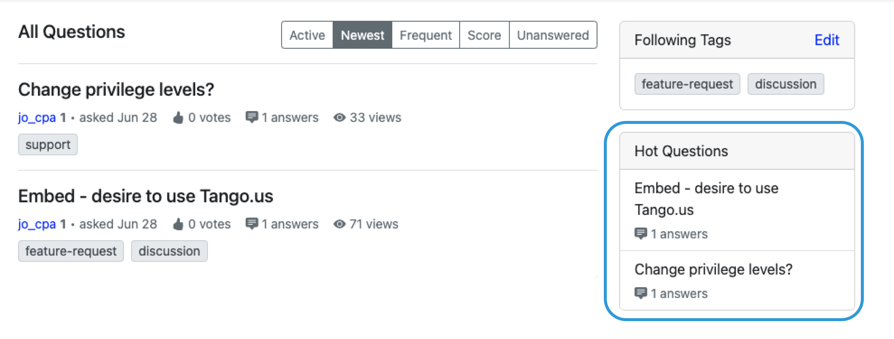
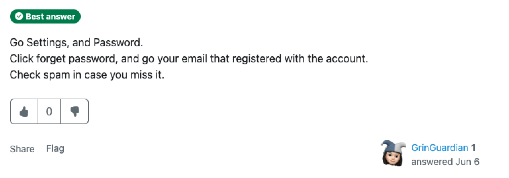
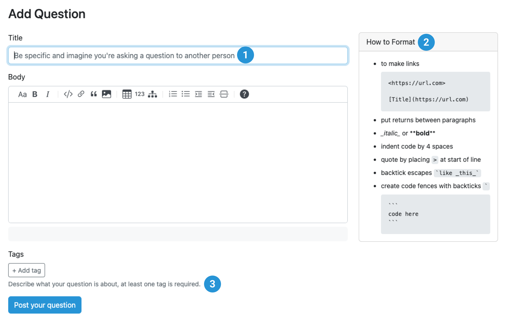
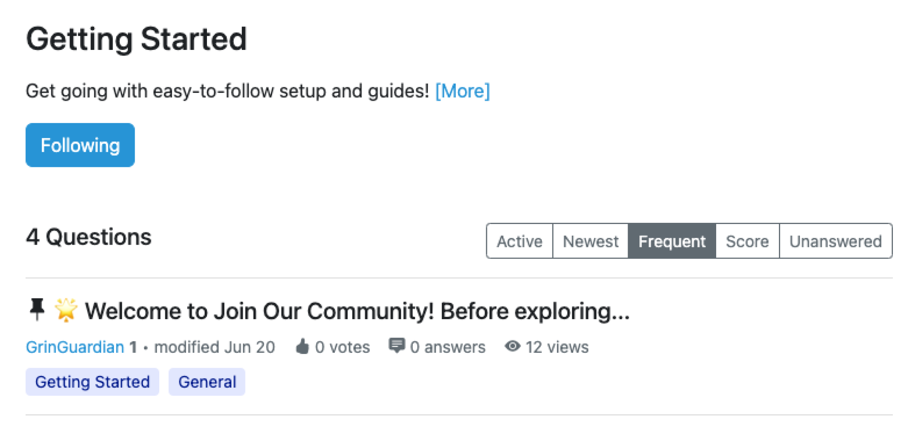
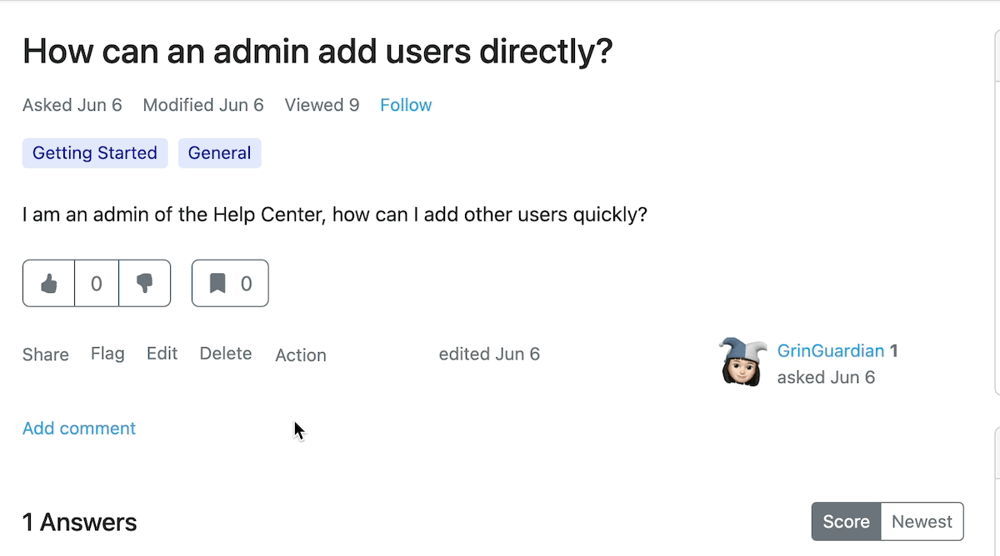
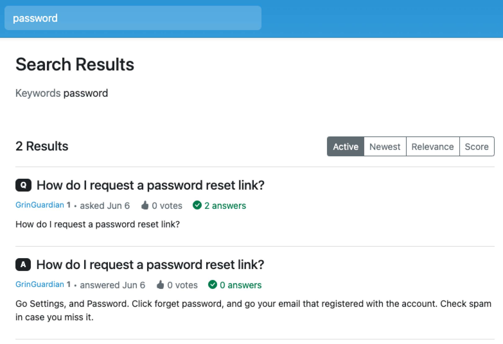
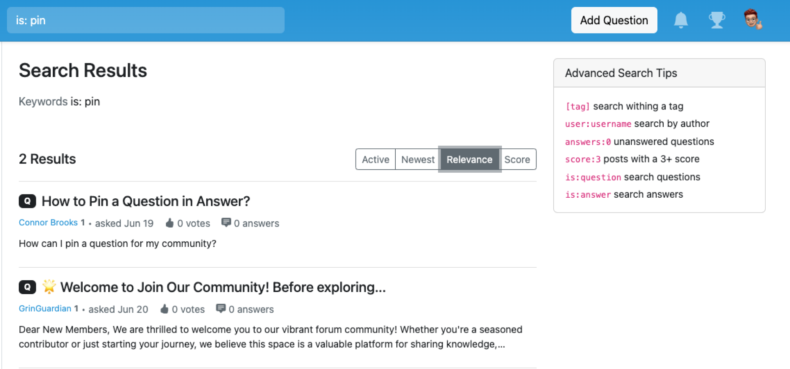
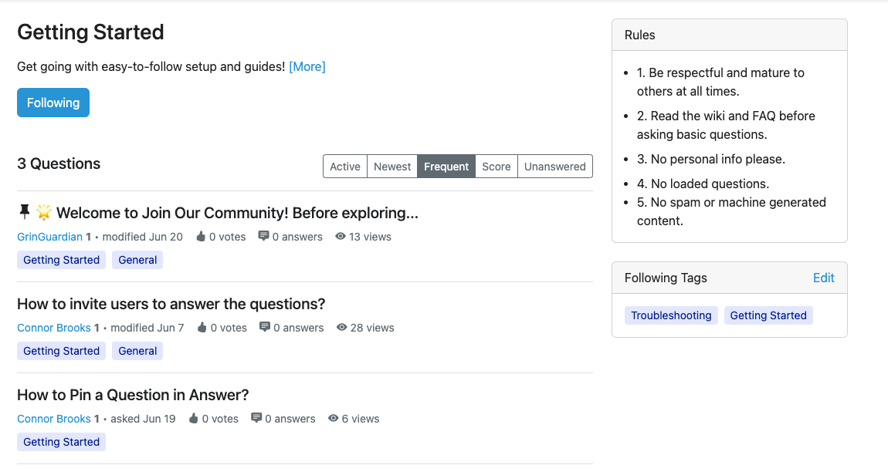
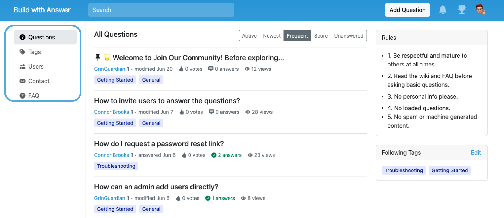

You have to admit that, your customers always have and will ask questions even if your product is perfect. Obviously, not every question needs a team to solve, which makes self-service effective (a support team is still needed). That’s what help center comes for: provide the right information, in a right approach, at the right time for your customers. 

In today’s blog, we will build a help center from the scratch with a bit of community sprit in Answer.

## What’s a Help Center
A Help Center serves as a valuable resource for users. It provides customers immediate help by helping them find answers and resolve issues independently.

When building a help center, here are 2 common questions you need to address:  

**What types of answers or help do users require?**       
**How can they always get the answers they require?**          
**How can I maintain and run help center efficiently?**

No worries, we will resolve these problems one by one and build a help center from the scratch together in the coming part of this blog.

## Why Answer for a Help Center?
Here’s how a traditional help center works: users come and seek answers, administrators provide answers constantly, and everything goes over again. 

As the content in the help center becomes abundant, things change. For users, finding the correct answer can be challenging. Similarly, administrators face the pressure of maintaining, and running an effective help center.

However, in Answer, everything is entirely different from traditional help center.
In Answer, **everyone can ask and respond**, creating a mutual way interaction. Every user can ask a question, contribute, vote for an answer, etc. Here, the user is no longer waiting for answers passively, but becomes a part of help center management. This also alleviates the pressure of administrators, allowing them to focus on the roadmap of the help center.

## Build a Help Center with Answer (Tutorials and Tips)
The essence of a help center is to provide the right answer to the problems occurring already, and Answer is born for this. Here’s how, and you’ll know why.

### 01. Start with the FAQs
It’s hard to immediately categorize questions in the beginning, why not start with the frequently asked questions? It not only makes sure your content is right for the help center, but also solves the most common issues for your customers at the moment.

The best part in Answer is that, as long as you run a support center with it, gradually you’ll get the FAQ at present because your customers have done it for you ;)

You can also [Pin recent FAQs](https://answer.dev/blog/2023/05/11/answer-1.0.9-release#whats-new) for your customers, or add as an additional resource in the sidebar, so that users can get the answer they need right away.

### 02. Make Content Consistent 
In Answer, help center is not just about self-service, but also about helping each other. Customers can also write answers to others, then admin and moderator will read and accept the best answers. If the question is answered perfectly in content, but not consistent with your style guide, you can have an admin or moderator to tune and make it looks shining again.

There are tips and notice to assist users deliver a concise question, while keeping the help center neat, such as tips for a clear title, format guidance, tag notes, etc.

### 03. Organize Categories with Tags
Time to make informative content easy to store and manage. In Answer, you can create new tags freely: add one in the Tag page, or build a new one right after a post.

Add a description for your users to know what the tag is about, and what content can they find in this tag. Users can click to view all the related information they require. With filter, they can find the content in the way they want.

### 04. Keep the Answers Fresh and Ready
Don’t make your help center end up with outdated answers. Though users are actively becoming a part of the community, moderators still need regular review and edit. Keep an eye on product launch, tweaks and updates, and you’ll notice how effective tags can be when updating the content.

When updating or editing a post, use [Unlist](https://answer.dev/blog/2023/05/11/answer-1.0.9-release#whats-new) to hide the post temporarily to avoid misunderstanding. 

### 05. Make Sure Users Can Access Answers Easily
Answer provides various ways for users to access the content they are searching for. Besides browsing in the help center, users can also get answers in the following ways:

1. Search       
	Users can search for a keyword for an answer, and use a filter to sort the answers they need.
	
    

	Answer also provides advanced search tips to boost search efficiency, offering a smooth self-service experience. 
	
    

2. Click or Follow a Tag      
	Users can click and view all the content under this tag. It’s like a bookshelf in the library where it collects all related books.

    

3. Related Questions      
	You’ll find related questions in every post, providing relevant content for users to access easily.
	
    

4. Add Additional Resources       
    You can customize Answer freely, such as adding extra information in the sidebar. In [Answer 1.1.0](../2023-06-15-answer-1.1.0-release/index.md), we support [plugin](https://github.com/answerdev/plugins) and your Answer is about to fly.

    

## What's More 
You might also be concerned about having numerous similar questions, which increases the workload for the administrators. Answer got it covered for you. When users fill a title, Answer automatically displays similar questions which are existed in the community. User can click and jump right to that question.

## It’s Your Turn to Build Your Answer Help Center
With the tutorials and tips in this blog, we believe you can now build a help center that your users will love. You are always welcome to check this guide when working on your help center, and we will also keep it updated too. It’s time to kick-start a help center for your product, and here’s a complete [Answer guide](https://answer.dev/docs/installation).

**Need more help?**
We are always [here for you](https://answer.dev/contact) with an Answer. 